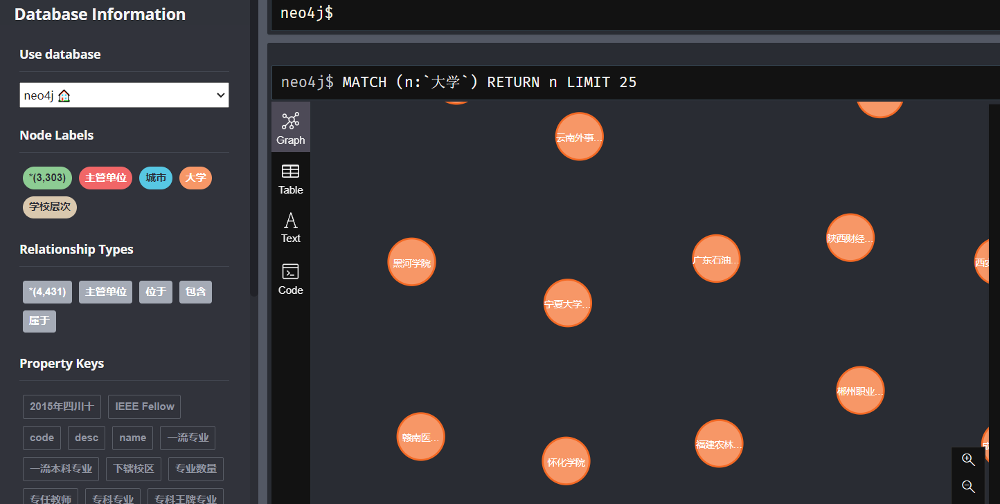
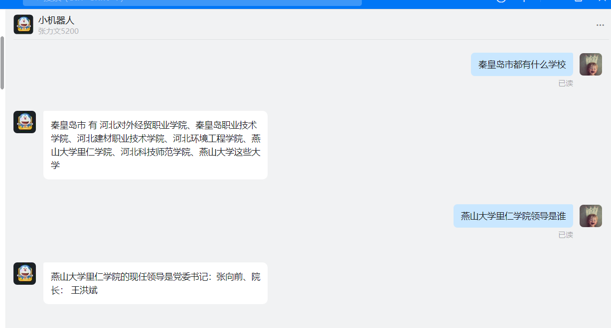

# 大学知识图谱问答，目前非常简单, 以后可能会更新

数据来源于百度百科，scrapy爬虫目录在scripts/univer/目录下 
然后将数据存储到neo4j中 对问题进行解析
通过actree得到实体，关键字得到问题类型，给出答案

# 目前neo4j结构


**1.1 知识图谱实体关系类型**

| 实体类型      | 实体数量 | 举例                   |
| ------------| -------- | ---------------------- |
| 大学         | 2735| 清华大学，北京大学             |
| 城市         | 481| 河北省，北京市
| 主管单位|  84 | 陕西省教育厅
| 层次|  3  |  211,985, 双一流                        |
| 总计|      | 3303|

**1.2 知识图谱实体关系类型**

|  中文含义   | 关系数量 | 举例                         |
|  ---------- | -------- | ---------------------------- |
|  主管单位     | 273    | 清华大学 主管单位是 北京市
|  位于     | 2980 | 清华大学 位于 北京市
|  包含 | 900    | 北京市 包含 顺义区 |
|  属于 | 278    | 北京大学 属于 985|
|  总计       | 4431   |  约4431对关系                            |

# 支持问题

```angular2html
河北省包含什么学校？
唐山市包含什么学校?
清华大学是211吗
211学校包含哪些
清华大学校训是什么?
燕山大学地址在哪
燕山大学现任领导人是谁
等
```

## 使用步骤

1 环境,个人python3.6.8, centos系统(阿里云服务器)

```
pip install -r requirements.txt
```

2 建立neo4j数据库 docker启动方式

```angular2html
docker run -d --name neo4j --restart=always \
-p 7474:7474 -p 7687:7687 \
-v /opt/neo4j/data:/data \
-v /opt/neo4j/logs:/logs \
-v /opt/neo4j/conf:/var/lib/neo4j/conf \
-v /opt/neo4j/import:/var/lib/neo4j/import \
--env NEO4J_AUTH=neo4j/123456 neo4j
```

3 插入数据 数据来源：先找到了一个大学列表，然后在百度百科中进行爬取, 数据已存在于data/data2.csv

```
cd scripts
python main.py
```

4 在config.py中修改知识库地址 

5 运行python chatbot_graph.py, 可在终端对话

6 (附加)在公网ip服务器上运行，可部署到钉钉中

```
python dingding.py
```

启动一个flask程序， 在钉钉开放后台中部署即可 具体配置可参考https://open.dingtalk.com/document/tutorial/create-a-robot
7 可以加入我的组织和机器人对话，有问题可以直接和我交流



# 参考链接
1、https://github.com/liuhuanyong/QASystemOnMedicalKG

2、https://github.com/wangle1218/KBQA-for-Diagnosis

# 总结
1、构建项目的原因：主要出于学习（骗star）构建了这个项目，增加自己对知识图谱的学习,希望能找到志同道合的朋友，一起进步

2、目前实现比较简单，总共花费大约一两天时间，没有使用算法，后续可能会优化比如

- 2.1 识别意图目前采用的是关键词的方法,可以通过一些机器学习、深度学习方法
- 2.2 实体识别采用actree，无法实现实体链指到实体库中的实体，比如搜北京有什么高校，就搜不到，必须搜索北京市有什么高校
- 2.3 数据方面比较少，想真正做到使用层面（给真正填报志愿的人用），还需要增加一些新的知识，比如历年分数线等
- 2.4 等等。。
希望各位不吝赐教，任何建议请联系我。
邮箱：652530495@qq.com
  

### 码云链接https://gitee.com/qukequke/university-knowledge-map